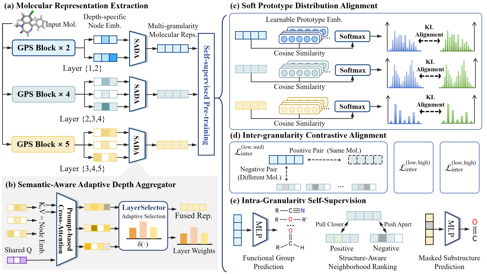

## To KDD reviewers：

Additional case studies and interpretation analyses accompanying our KDD rebuttal are available in the /main/case_study.

# ProtoMolCL

ProtoMolCL is a prototype-guided molecular representation learning framework designed to capture molecular semantics at multiple structural granularities. The project provides a complete pipeline for molecular data preprocessing, multi-level prototype construction, CReM-based molecular perturbation, self-supervised pretraining, and downstream evaluation on MoleculeNet and MoleculeACE benchmarks.

## Overview



The framework organizes molecular information into multiple semantic levels and assigns each molecule a soft affiliation vector over the prototypes at each level. These multi-granularity prototype signals are then used during pretraining to improve molecular representation learning and downstream generalization.

The main workflow includes:

1. Preparing the molecular pretraining dataset.
2. Exploring the number of prototypes at different semantic levels.
3. Constructing soft prototype affiliation labels.
4. Generating CReM-based molecular perturbations.
5. Pretraining the molecular encoder.
6. Fine-tuning and evaluating the model on downstream datasets.

## Project Structure

```text
ProtoMolCL/
├── config/                         # Configuration files
│
├── data/
│   ├── finetune/
│   │   ├── moleculeace/            # MoleculeACE downstream datasets
│   │   └── moleculenet/            # MoleculeNet downstream datasets
│   └── pretrain/
│       └── atom_vocab_pretrain.pkl # Atom vocabulary used for pretraining
│
├── data_processor/
│   ├── descriptors/                # Molecular descriptor implementations
│   ├── compute_crem.py             # CReM-based molecular perturbation generation
│   ├── data_layer1.py              # Low-level prototype-label processing
│   ├── data_layer3.py              # Mid-level prototype-label processing
│   ├── data_layer5.py              # High-level prototype-label processing
│   ├── explore_low_proto_k.py      # Search for the number of low-level prototypes
│   ├── explore_mid_proto_k.py      # Search for the number of mid-level prototypes
│   ├── explore_high_proto_k.py     # Search for the number of high-level prototypes
│   └── zinc_200w.csv               # Molecular pretraining corpus
│
├── model/
│   ├── finetune/                   # Fine-tuning components
│   ├── models/                     # Molecular encoders and model definitions
│   ├── pretrain/                   # Pretraining objectives and modules
│   └── utils/                      # Utility functions
│
├── splitters.py                    # Dataset splitting utilities
├── finetune_moleculeace.py         # Fine-tuning on MoleculeACE
├── finetune_moleculenet.py         # Fine-tuning on MoleculeNet
├── pretrain.py                     # Main pretraining entry point
└── processed_dataset.zip           # Optional processed dataset archive
```

## Requirements

To run the codes, You can configure dependencies by restoring our environment:
```
conda env create -f environment.yaml
```

and then：

```
conda activate my_env
```

## Data Preparation

Download processed_dataset.zip and zinc-gps.pt [here](https://drive.google.com/file/d/1YPN8UL0fXiECuvPcN1hP4WxvCQV_lCxQ/view?usp=drive_link).

The processed_dataset.zip file contains the preprocessed molecular data used in our experiments, including the cleaned and formatted inputs required for model training and downstream evaluation. The zinc-gps.pt file contains the model parameters learned during pretraining on the ZINC dataset. These files are provided to facilitate reproducibility and allow users to directly perform downstream fine-tuning and evaluation without repeating the complete data preprocessing and pretraining procedures.

## Multi-Granularity Prototype Construction

ProtoMolCL constructs prototypes at three semantic levels. The corresponding scripts first explore a suitable number of clusters and then generate prototype labels or soft prototype affiliations.

### 1. Explore prototype numbers

Run the prototype-number search scripts:

```bash
python data_processor/explore_low_proto_k.py
python data_processor/explore_mid_proto_k.py
python data_processor/explore_high_proto_k.py
```

These scripts evaluate candidate values of \(K\) using clustering-quality criteria such as:

- Silhouette score
- Calinski–Harabasz score
- Davies–Bouldin score
- Minimum cluster-size constraints

The selected prototype number and clustering results are saved to the output directories configured in each script.

### 2. Generate prototype affiliation labels

After determining the prototype numbers, generate the prototype labels for the three levels:

```bash
python data_processor/data_layer1.py
python data_processor/data_layer3.py
python data_processor/data_layer5.py
```

The scripts produce molecular prototype assignments or soft affiliation vectors that are used during pretraining.

Before running them, verify that the input paths, output paths, prototype-center files, and SMILES columns match your local environment.

## CReM-Based Molecular Perturbation

CReM is used to generate chemically valid local structural perturbations for molecular data augmentation.

Run:

```bash
python data_processor/compute_crem.py
```

A CReM replacement database is required. Update the fragment-database path in the script or command-line arguments before execution.

## Pretraining

After the molecular data, prototype labels, and molecular perturbations have been prepared, start pretraining with:

```bash
python pretrain.py
```

The exact training settings are controlled by the configuration files under `config/` and by the arguments defined in `pretrain.py`.

Before training, verify the following paths:

- Pretraining molecular dataset
- Atom vocabulary
- Multi-level prototype-label files
- CReM perturbation data
- Model checkpoint directory
- Training-log directory

To inspect available command-line arguments, run:

```bash
python pretrain.py --help
```

## Fine-Tuning and Evaluation

### MoleculeNet

Run downstream fine-tuning on MoleculeNet datasets with:

```bash
python finetune_moleculenet.py
```

MoleculeNet typically includes molecular property-prediction benchmarks such as BBBP, Tox21, ToxCast, SIDER, ClinTox, BACE, HIV, MUV, and related datasets supported by the implementation.

### MoleculeACE

Run activity-cliff evaluation on MoleculeACE with:

```bash
python finetune_moleculeace.py
```

MoleculeACE is used to evaluate whether the learned representations can distinguish structurally similar molecules with substantially different biological activities.

Use the help option to inspect script-specific arguments:

```bash
python finetune_moleculenet.py --help
python finetune_moleculeace.py --help
```

## Reproducibility Notes

For reproducible experiments:

- Use fixed random seeds in clustering, pretraining, and fine-tuning.
- Record the selected prototype number at each semantic level.
- Keep the molecule ordering consistent across SMILES files and prototype-label files.
- Ensure that soft-label arrays and molecular CSV files have the same number of rows.
- Save preprocessing metadata, descriptor names, clustering centers, and data-split indices.
- Report the mean and standard deviation over multiple random seeds for downstream tasks.

## Important Data-Alignment Check

Prototype labels must correspond exactly to the same molecular ordering used by the pretraining dataset. Matching only the number of rows is not sufficient. It is recommended to align files using one or more of the following fields:

- Original row index
- Canonical SMILES
- A persistent molecule identifier
- A validated preprocessing index

Incorrect ordering can assign one molecule's prototype affiliation vector to another molecule.

## Citation

We sincerely thank the following open-source projects for supporting our work. We have also cited them appropriately in the paper.

[1] Wan Y, Wu J, Hou T, et al. Multi-channel learning for integrating structural hierarchies into context-dependent molecular representation[J]. Nature Communications, 2025, 16(1): 413.

[2] Xia J, Zhao C, Hu B, et al. Mole-bert: Rethinking pre-training graph neural networks for molecules[C]//The Eleventh International Conference on Learning Representations. 2023.

[3] Wen Q, Ju M, Ouyang Z, et al. From coarse to fine: enable comprehensive graph self-supervised learning with multi-granular semantic ensemble[C]//Forty-first International Conference on Machine Learning. 2024.

## Contact

For questions about the code or experiments, please open an issue or contact the authors of the project.
